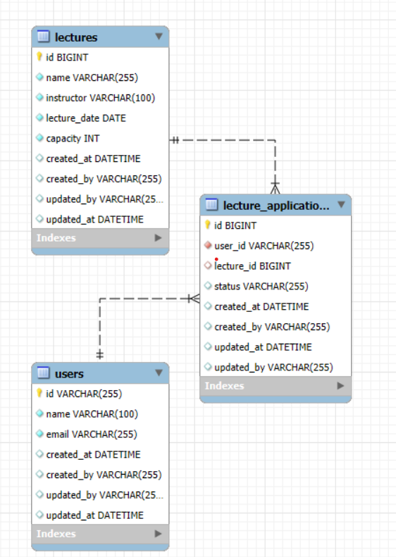

설계 테이블 ERD 및 이유
================================


### user의 정보를 담고있는 Users 테이블
- Users <-> Lecture_Applications 1:N 하나의 사용자는 여러 특강에 신청할 수 있음
```
  Table: users
  Columns:
  id varchar(255) PK
  name varchar(100)
  email varchar(255)
  created_at datetime
  created_by varchar(255)
  updated_by varchar(255)
  updated_at datetime
  ```
### lectur의 정보를 담고있는 Lectures 테이블
- Lectures <-> Lecture_Applications  1:N  하나의 특강에 여러 신청자가 있을 수 있음.
```angular2html
    Table: lectures
    Columns:
    id bigint PK 
    name varchar(255) 
    instructor varchar(100) 
    lecture_date date 
    capacity int --> 수용인원은 30명으로 한정되어있어 int로 지정
    created_at datetime 
    created_by varchar(255) 
    updated_by varchar(255) 
    updated_at datetime
```
### user가 신청한 lectures 정보 (history)를 담고있는 Lecture_Application 테이블
- 같은 사용자에게 여러 번의 특강 슬롯이 제공되지 않게 제한할 것인가? (UNIQUE KEY를 만들어 user_id와 lecture_id의 조합이 중복되지 않게함, 중복 시 에러 발생)
- 30명 제한은 CHECK로 관리할 수 있으나 Service에서 비지니스로직으로 관리하는 것이 좋을 것 같음.
- @Transactional 을 통해 동시성 관리, Lecture_Application 테이블에서 신청된 인원 카운트해 정원 초과 여부 미리 확인 후 신청 처리하도록 처리함
```angular2html
    Table: lecture_applications
    Columns:
    id bigint AI PK --> history관리하는 id로 시퀀셜하게 채번
    user_id varchar(255) 
    lecture_id bigint 
    status varchar(255) 
    created_at datetime 
    created_by varchar(255) 
    updated_at datetime 
    updated_by varchar(255)
```
각테이블에는 FK제약조건이 존재함
lecture_applications 테이블의 lecture_id 컬럼 ->  Lectures 테이블의 id 컬럼을 참조하도록 설정
즉, lecture_applications.lecture_id에 저장되는 값은 반드시 Lectures.id에 존재함.(데이터의 무결성을 유지). 

lecture_applications 테이블의 lecture_id는 항상 Lectures 테이블의 id에 존재하는 값만 가질 수 있음.
만약 Lectures 테이블에서 특정 id를 삭제하려면, 해당 id를 참조하고 있는 모든 lecture_applications 행을 먼저 삭제하거나 처리. 

시스템 컬럼 4가지 created_at / created_by / updated_by / updated_at 는 테이블 관리 목적으로 넣었습니다.
